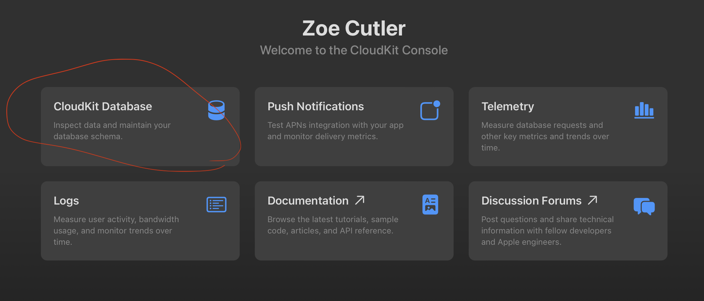
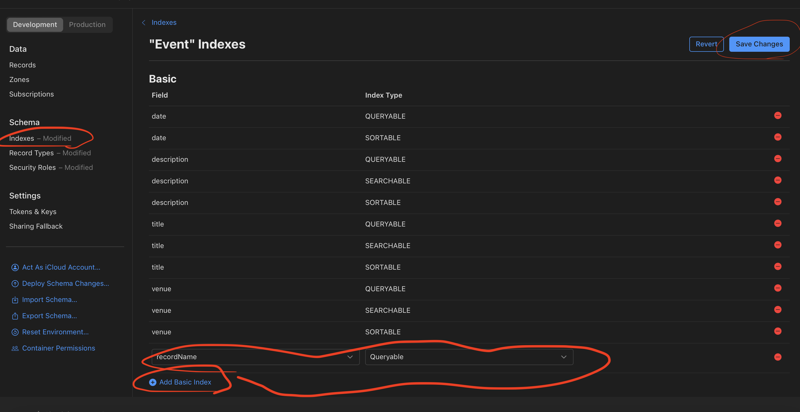

#  Sample Code: CloudKit Public Database

This is a sample app that allows users to add Events to CloudKit's public database, and see Events that other users have added.

## Setting Up

### Create your iCloud Container on CloudKit
1. In the Xcode Project File (blue icon on the top left of Xcode) -> for this iOS target -> Signing & Capabilities: change the Development Team to your Development Team (i.e.: select your name from the list).

2. Change the Bundle Identifier of the app to be unique to you. For example:
    * Bundle: `com.yourname.appname`
3. Click the 'plus' button under your iCloud containers to create a new container with a name that matches your Bundle Identifier.
    * iCloud container: `iCloud.com.yourname.appname`

4. Press the refresh button below the iCloud containers so that Xcode updates it.
5. Click [CloudKit Console](https://icloud.developer.apple.com/) and log in with your developer account info. Click on "iCloud database."

6. Using the dropdown on the top left, make sure that you can find the container you just created (i.e.: `iCloud.com.yourname.appname`) in the list of containers.

7. Go to the `CloudKitService` class and change its `container` property. Paste your iCloud container name (from signing and capabilities OR iCloud console) into the `CKContainer(identifier:)` initializer.

## Testing Current Functionality
1. Run the app on an iOS simulator or device.
2. Make sure that the simulator or device is signed into your iCloud account, and that iCloud Drive is turned on. (You may want to make another iCloud account just for development on the simulator. You can do this on iCloud.com.)
3. If you just signed in to your iCloud account, you might need to quit the app and reopen it.
4. Since this is a new container, you probably won't see any events on the view. Try adding an event with the phone or simulator.
6. Quit the app (don't just put it in the background, but swipe up to close it, or press "stop" on Xcode if it's running) and reopen it. Do you see the event you just added?
> [!TIP]
> It's possible that you will see an error like "field recordName is not marked queryable." To solve this, return to your CloudKit console for your app's container. Select "Indexes" on the right, and select your Event type. Add a new index for recordName to be queryable.
> 

## Adding Your Own Data Types
1. Create a new file named like `YourTypeName.swift`.
2. Create a new struct representing this type.
```Swift
struct YourTypeName {
    var someProperty: SomeType
    // etc
}
```
3. Add `CloudKitService` methods that [create, read, update, and delete](https://en.wikipedia.org/wiki/Create,_read,_update_and_delete) instances of your type.
```Swift
class CloudKitService {
    // existing event methods

    func saveNewType(_ newType: NewType) async throws {
        // copy implementation from saveEvent(_:)
        // adjust it to store the properties of your new type
    }

    // other methods for new type
}
```
4. Create a ViewModel to store your type, or (if this new type is related to Events), integrate this type into the existing EventView Model

## Further Learning
* Want to store images? Use [CKAsset](https://www.hackingwithswift.com/read/33/4/writing-to-icloud-with-cloudkit-ckrecord-and-ckasset). (Note: this article is using UIKit and completion handlers, so it requires careful reading to use in the SwiftUI and Swift Concurrency context of this app.
* Want to create types that relate to each other? (i.e.: Comments on an Event) Use [CKRecord.Reference](https://developer.apple.com/documentation/cloudkit/ckrecord/reference).
